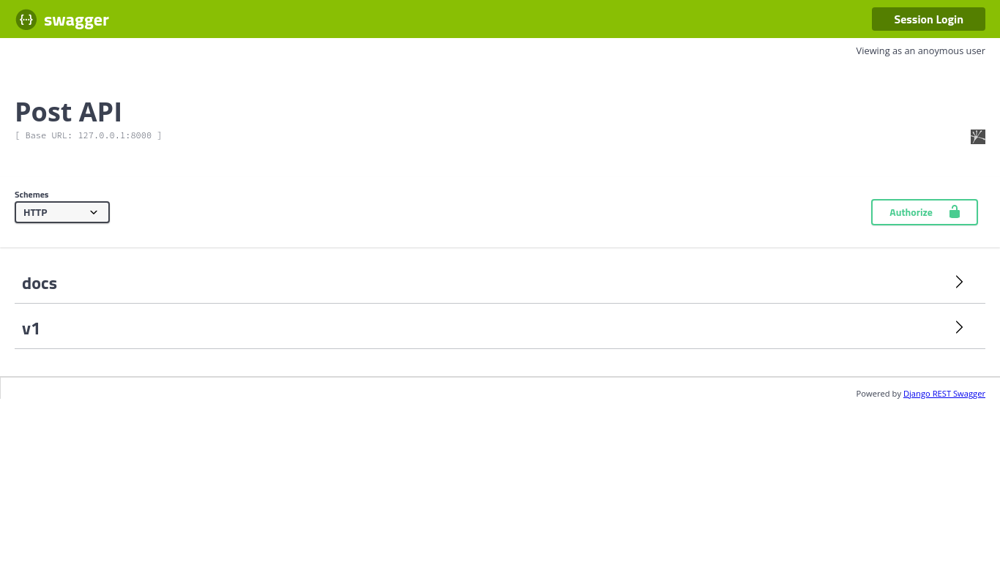
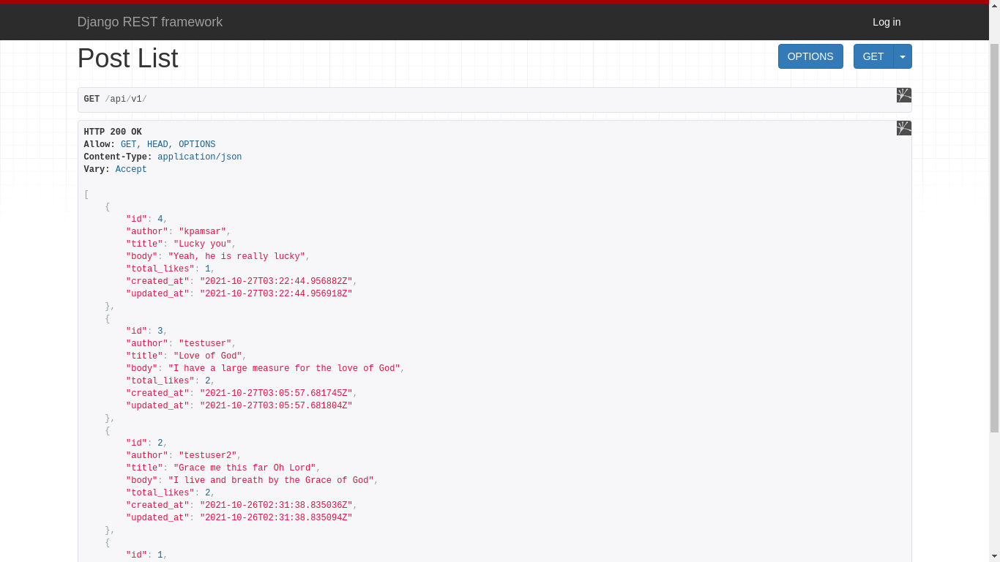
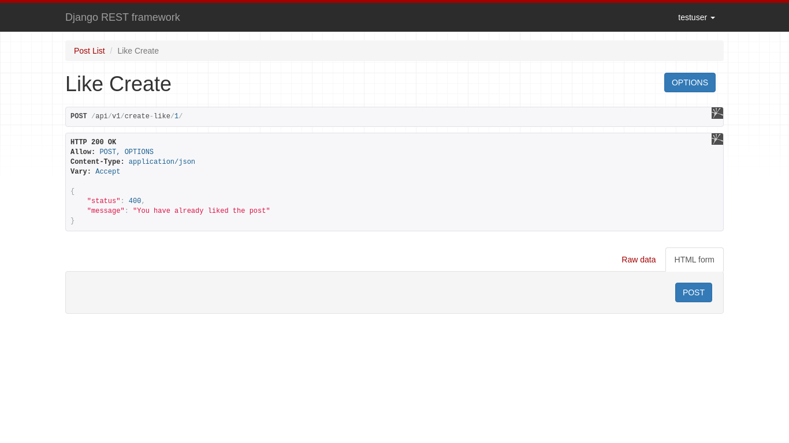

****Discussion Forum API****
-
> This is an application that uses Django and Django rest framework to provides an API for a simple discussion service
(discussion forum with a single thread).

## Features

- Python 3.9, Django 3.2.8, Django-rest-auth 0.9.5, Django-rest-swagger 2.2.0, Djangorestframework 3.12.4
- Install via [Pip](https://pypi.org/project/pip/)
- User log in/out, sign up, password reset via API
- Create a post via API
- Get a list of posts ordered by date of creation, information about the count of likes and like count included via API
- Edit a post created via API by the authenticated user.
- Delete a post created via API by the authenticated user.
- Like another user's post via API.

The code style used for the project is PEP 8 -- Style Guide for Python Code and Flake8: For Style Guide
Enforcement.

---
## Screenshots




---
## Table of Contents
* **[Installation](#installation)**
  * [Pip](#pip)
* [Setup](#setup)

---
## Installation
The application can be installed via Pip. To start, 
clone the repo to your local computer and change into the proper directory.

```
$ git clone https://github.com/Fachiis/Backend_Predict
$ cd Backend_Predict
```
```
$ python3 -m venv Backend_Predict
$ source Backend_Predict/bin/activate
(Backend_Predict) $ pip install -r requirements.txt
(Backend_Predict) $ python manage.py migrate
(Backend_Predict) $ python manage.py createsuperuser
(Backend_Predict) $ python manage.py runserver
# Load the site at http://127.0.0.1:8000/api/v1
```

## Setup

```
# Run Migrations
(Backend_Predict) $ python manage.py migrate

# Create a Superuser
(Backend_Predict) $ python manage.py createsuperuser

# Confirm everything is working:
(Backend_Predict) $ python manage.py runserver

# Load the site at http://127.0.0.1:8000/api/v1
```